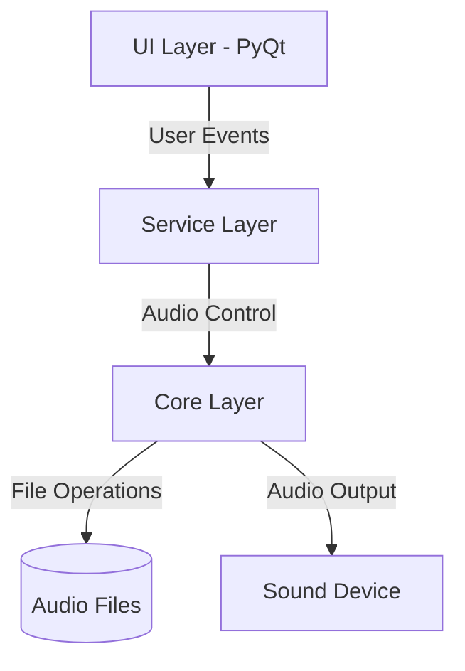
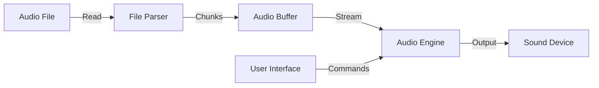

# System Architecture

## High-Level Component Diagram



## Data Flow Diagram



## Module Structure

```
src/
├── ui/
│   ├── main_window.py
│   ├── playlist_view.py
│   └── controls.py
├── service/
│   ├── audio_service.py
│   └── playlist_service.py
├── core/
│   ├── audio_engine.py
│   ├── file_handler.py
│   └── metadata.py
└── main.py
```

## Key Components

### UI Layer

- Main Window: Primary application interface
- Playlist View: Track list management
- Controls: Playback interface

### Service Layer

- Audio Service: Manages playback state including automatic track progression
- Playlist Service: Handles track organization

### Core Layer

- Audio Engine: Low-level audio processing with automatic track transition handling
- File Handler: Audio file operations
- Metadata: Track information management

## Technology Stack

- **Frontend**: PyQt6
- **Audio Processing**: sounddevice, pydub
- **Testing**: pytest
- **Code Quality**: Black, Ruff
- **Build/Package**: uv, pyproject.toml
